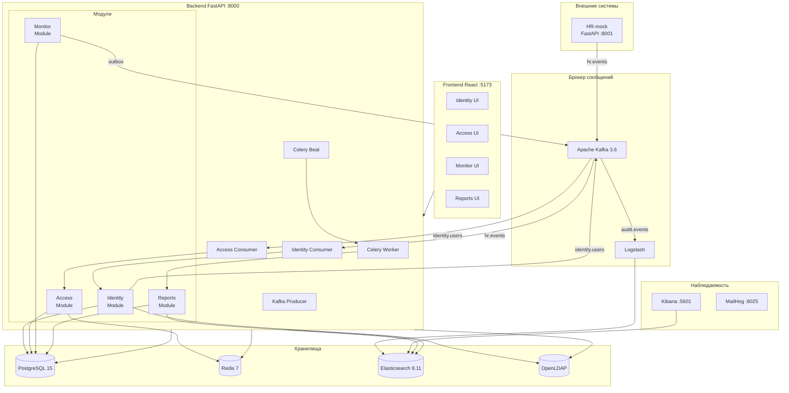
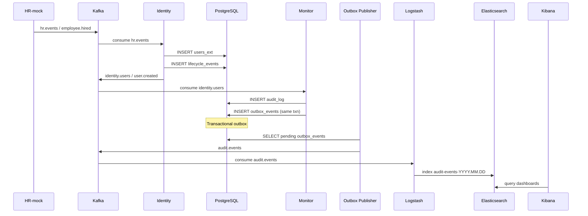
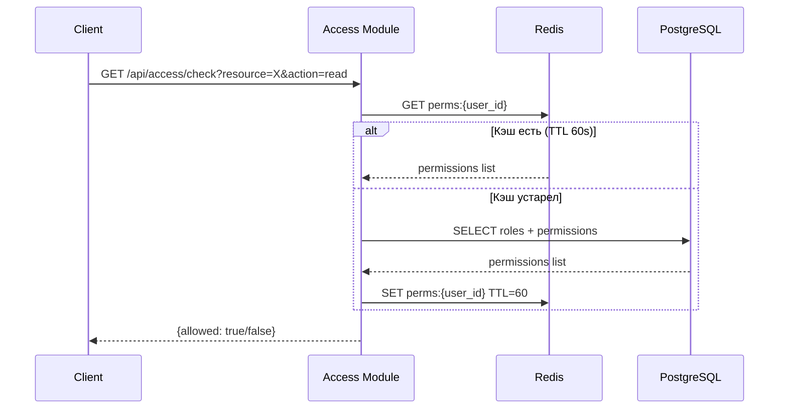
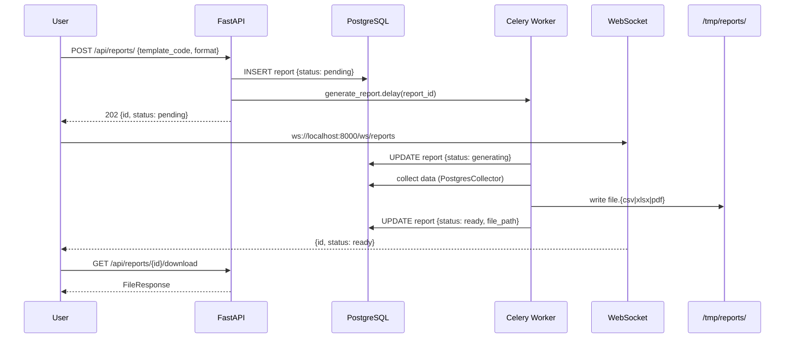

# AccessGuard — Архитектура системы

## Общая схема



## Потоки данных

### HR-событие → Kibana (полная цепочка)



### Проверка прав доступа (кэш Redis)



### Генерация отчёта (асинхронная)



## Компоненты

### Backend (FastAPI)

```
app/
├── main.py                 # FastAPI, CORS, lifecycle (kafka runner)
├── config.py               # Pydantic Settings (из .env)
├── database.py             # AsyncSessionLocal, get_db dependency
├── celery_app.py           # Celery instance + beat schedule
├── kafka/
│   ├── producer.py         # AIOKafka producer (singleton)
│   ├── consumer.py         # BaseConsumer ABC
│   ├── events.py           # KafkaEvent envelope {topic,event_type,payload,...}
│   ├── topics.py           # TOPIC_* константы
│   └── runner.py           # asyncio task для всех consumers + outbox_loop
├── elastic/
│   ├── client.py           # AsyncElasticsearch singleton
│   ├── indices.py          # create_index_templates()
│   └── search.py           # search_audit_events(), aggregation helpers
├── core/
│   ├── auth.py             # JWT encode/decode, token types
│   ├── security.py         # bcrypt hash/verify
│   └── deps.py             # get_current_admin, require_roles()
└── modules/
    ├── identity/
    │   ├── service.py      # UserExtService (flush-only)
    │   ├── consumer.py     # HR events → Identity (explicit commit)
    │   └── router.py       # /api/identity/*
    ├── access/
    │   ├── service.py      # AccessService (Redis cache, flush-only)
    │   ├── consumer.py     # identity.users → Access (explicit commit)
    │   └── router.py       # /api/access/*
    ├── monitor/
    │   ├── audit_service.py    # log() — transactional outbox
    │   ├── rules.py            # 4 simple + 6 complex detection rules
    │   ├── alert_service.py    # fire_alert(), cooldown check
    │   ├── notification_service.py  # email/webhook/log/kafka
    │   ├── tasks.py            # Celery: publish_outbox, evaluate_rules
    │   └── router.py           # /api/monitor/*
    └── reports/
        ├── generators/
        │   ├── base.py         # BaseReportGenerator + GENERATORS registry
        │   ├── collectors.py   # PostgresCollector, ElasticCollector
        │   └── renderers.py    # CsvRenderer, XlsxRenderer, PdfRenderer
        ├── tasks.py            # generate_report, check_report_schedules
        └── router.py           # /api/reports/* + ws://*/ws/reports
```

### Ключевые архитектурные решения

#### 1. Flush-only pattern в сервисах
Все сервисы вызывают только `db.flush()`, никогда `db.commit()`.
Commit выполняется в `get_db()` dependency (для роутеров) или явно в consumers.
Это позволяет тестировать сервисы без сайд-эффектов.

#### 2. Transactional Outbox
```sql
-- Всегда в одной транзакции:
INSERT INTO audit_log (...);          -- источник истины
INSERT INTO outbox_events (...);       -- гарантия доставки
-- COMMIT (в get_db)

-- Отдельный Celery task (каждые 10с):
SELECT * FROM outbox_events WHERE status='pending' LIMIT 100;
-- publish to Kafka
UPDATE outbox_events SET status='published';
```

#### 3. Redis permission cache
```
perms:{user_id} → JSON list of "module:action" strings, TTL=60s
Инвалидируется при assign_role(), revoke_role(), revoke_all()
```

#### 4. Append-only audit_log
```sql
CREATE TRIGGER prevent_audit_modification
BEFORE UPDATE OR DELETE ON audit_log
FOR EACH ROW EXECUTE FUNCTION prevent_audit_modification();
-- Функция: RAISE EXCEPTION если запись старше 1 минуты
```

#### 5. Correlation ID
Все события несут `correlation_id` (UUID) для сквозной трассировки
через Kafka → Logstash → Elasticsearch → Kibana.

## Kafka-топики и события

| Топик                   | Ключ | Продюсер   | Консьюмеры         |
|-------------------------|------|------------|--------------------|
| `hr.events`             | emp_id | HR-mock  | Identity consumer  |
| `identity.users`        | user_id | Identity | Access, Monitor   |
| `identity.lifecycle`    | user_id | Identity | Monitor           |
| `access.roles`          | user_id | Access  | Monitor            |
| `access.requests`       | req_id | Access   | Monitor            |
| `monitor.alerts`        | alert_id | Monitor | Notification      |
| `audit.events`          | log_id | Outbox   | Logstash → ES      |
| `reports.notifications` | report_id | Reports | —               |

## Роли и разрешения (RBAC)

| Роль              | Описание                                    |
|-------------------|---------------------------------------------|
| system_admin      | Полный доступ ко всем модулям               |
| security_officer  | Monitor, Rules, Alerts + Access readonly    |
| hr_operator       | Identity (CRUD) + Access readonly           |
| auditor           | Только чтение: Monitor, Reports, Audit      |
| it_admin          | Access + Identity readonly                  |
| manager           | Access requests, Identity readonly          |
| user              | Просмотр собственного профиля               |

## Переменные окружения

Все переменные документированы в `.env.example`. Обязательно изменить перед продуктивной
эксплуатацией:
- `JWT_SECRET` — случайная строка ≥ 32 символа
- `LDAP_BIND_PASSWORD` — пароль LDAP-администратора
- Пароли PostgreSQL/Redis в docker-compose.yml
